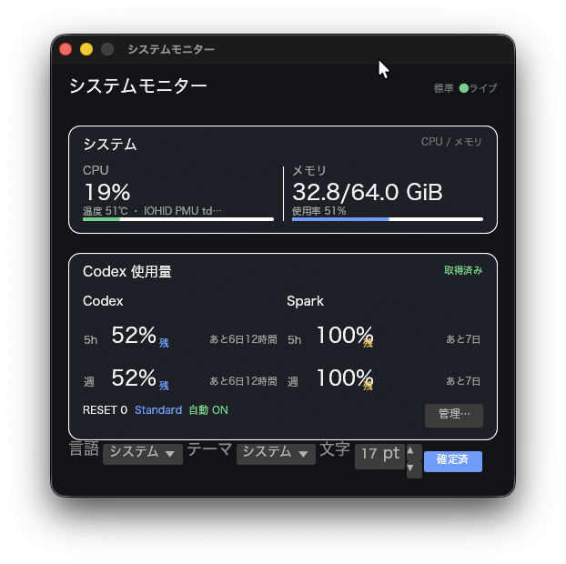
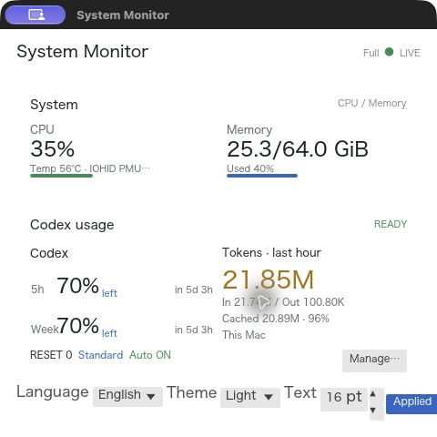
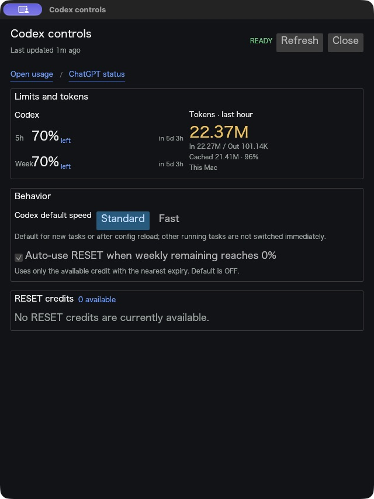

# mini-system-monitor-rs

[English](README.md) | [日本語](README.ja.md)

`eframe/egui` と Rust で実装したmacOSネイティブのシステムモニターです。コンパクトなデスクトップウインドウに、ローカルのCPU・メモリ情報、Codex利用状況、サービスティア操作、RESETクレジット管理をまとめて表示します。

## プロジェクトの位置づけ

本プロジェクトは独立した非公式ユーティリティであり、OpenAIとの提携やOpenAIによる承認を受けた製品ではありません。Codex連携はローカルの `codex app-server` インターフェースに依存するため、Codex側の変更に応じて更新が必要になる場合があります。

## 機能

### システムモニター

- CPU使用率
- メモリ使用率と使用量・総容量（GiB）
- 検出元を併記するApple Silicon SoC/PMU温度のベストエフォート取得
- 常に最前面へ表示する通常表示とコンパクト表示
- 日本語、英語、システム言語
- ライト、ダーク、システムテーマ
- 10〜32 ptで調整できるUI文字サイズ

言語、テーマ、文字サイズ、RESET自動使用の設定は保存されます。表示モードはモニター画面から切り替えられ、起動時は通常表示になります。

### Codex利用状況と操作

- Codexの5時間枠・週間枠の残量
- Sparkの制限枠が返された場合の5時間枠・週間枠
- Standard/Fastサービスティアの表示と切り替え
- RESETクレジット数、並び順、説明、最短有効期限
- macOSのシステムタイムゾーンによるRESETクレジットの正確な期限と相対時間
- 週間残量が0%になった場合の任意のRESET自動使用
- 独立したサイズ変更可能なCodex管理ウィンドウ
- 手動更新、Codex利用状況ページ、OpenAIステータスへのリンク

RESETの期限はCodexから絶対時刻として取得します。表示言語とは独立してmacOSのシステムタイムゾーン規則で変換するため、日本に設定されたMacでは `JST`、夏時間のある地域では期限日時に適用される略称とオフセットを表示します。ローカル変換が利用できない場合のみUTCへフォールバックします。

## UIプレビュー

利用枠とRESETの値はサインイン中のCodexアカウントによって異なります。次の画像は表示例です。

### メインモニター

<p>
  
  
</p>

### Codex管理



## Codex接続

アプリはローカルの `codex app-server` をstdio経由で起動し、JSON-RPC接続を初期化します。ローカル環境と対応するCodex/ChatGPTアプリの配置から、利用可能なCodex実行ファイルを探します。

通常の更新では次を読み取ります。

- `account/rateLimits/read`
- `config/read`

Codexのポーリングはシステム情報のサンプリングとは別に動作し、通常は60秒ごとに更新します。失敗時は直近の正常値を保持したまま更新間隔を延ばします。`rateLimitsByLimitId` にSparkが含まれない場合、推測した値を表示せず「未検出」として扱います。

OpenAI APIキーは不要で、Webページのスクレイピングも行いません。ただし、上記メソッドに対応するローカルCodexが正常に動作し、サインイン済みである必要があります。

### Codexの状態を変更する操作

StandardまたはFastを選択すると、`config/batchWrite` を通じてCodexのユーザー設定を書き込み、再読み込み後の実効値を確認します。

RESETの自動使用は既定で**オフ**です。有効にした場合でも、次の条件をすべて満たすときだけクレジットを使用します。

- Codexの週間枠が想定する10,080分の枠である
- 週間残量が正確に0%である
- RESETクレジットの完全な一覧を取得できている
- 同じ週間リセット境界をまだ処理していない

条件を満たすクレジットのうち、有効期限が最も近いものを選択します。`~/Library/Application Support/mini-system-monitor-rs/codex-auto-reset.json` の冪等性ジャーナルにより、再試行や再起動による重複使用を防ぎます。

## 温度取得

macOSでは、最初にprivate IOHIDセンサー経路を試し、次に `sysinfo` のコンポーネント、最後に利用可能な `osx-cpu-temp`、`istats`、`powermetrics` を時間制限付きで試します。これはApple SiliconのSoC/PMU系温度をベストエフォートで取得するもので、個別CPUコアの厳密な温度ではありません。有効な値を取得できない場合は `温度 --` / `Temp --` と表示します。

## 必要環境

- アプリバンドルはmacOS 14以降
- `rust-toolchain.toml` で固定されたRustツールチェーン
- ネイティブリンク、バンドル検証、署名に必要なXcode Command Line Tools
- Codex機能を使う場合はCodex CLI、Codexアプリ、またはChatGPTアプリ
- アカウント情報を取得する場合は認証済みCodexセッション

Codexデータを取得できない場合でも、システムモニター部分は動作します。

clone直後に、固定済みRust依存関係を一度取得します。

```bash
cargo fetch --locked
```

## ビルド済みネイティブアプリを実行

```bash
Scripts/materialize-app.sh
Scripts/run-app.sh
```

materializerはロック済み依存関係を使ったオフラインrelease build、アドホック署名、bundle検証を行い、安定したローカルruntimeである `dist/Mini System Monitor.app` をatomicに更新します。launcherはbundle executableの存在と実行権限を確認してからnative appを直接開き、Cargoや `target/` 内のbinaryを経由しません。

bundle、または `dist/Mini System Monitor.app/Contents/MacOS/mini-system-monitor-rs` が存在しない、もしくは実行可能でない場合、`Scripts/run-app.sh` は正確なmaterialization手順を表示して停止します。`Scripts/materialize-app.sh` を再実行し、runtime fallbackとして `cargo run` や `target/` 内のbinaryを使わないでください。

materializationはオフラインでbuildするため、fresh cloneでは先に `cargo fetch --locked` を一度実行してください。

## 開発専用のソース実行

Rust sourceを明示的に開発するときだけ、次のコマンドを使用できます。

```bash
cargo run --locked
```

これは通常利用、インストール経路、または実行可能handoffの起動方法ではありません。

## 任意のpackaging先へmacOSアプリをビルド

```bash
Scripts/build-app.sh --output /path/to/package-output
```

ロック済み依存関係を使ったオフラインrelease buildを行い、ソース管理されたアイコンとbundle情報を使って、指定したpackaging directory配下にアドホック署名・検証済みの `Mini System Monitor.app` を生成します。出力先に同名アプリが存在していてはいけません。このコマンドはconstruction primitiveです。安定したローカルruntimeには `Scripts/materialize-app.sh` を使用してください。

インストールする場合は、実行中の旧バージョンを終了してから、後述のsource-owned installerを使用します。

アドホック署名はローカル利用向けです。他のユーザーへダウンロード可能なアプリとして配布する場合は、Apple Developer IDによる署名とnotarizationが必要です。

## Codexまたはターミナルからインストール

このリポジトリには `AGENTS.md` が含まれているため、Codexは固定済みのセットアップ、ビルド、検証、インストールコマンドをリポジトリから直接読み取れます。依存関係を取得した後、システムのアプリケーションフォルダへ次のコマンドでインストールします。

```bash
Scripts/install-app.sh --destination "/Applications/Mini System Monitor.app"
```

インストーラーは既存アプリを上書きしません。実行中のアプリを終了し、既存アプリの置換が明示的に承認されている場合は次を使います。

```bash
Scripts/install-app.sh \
  --destination "/Applications/Mini System Monitor.app" \
  --replace
```

置換時は、旧アプリを宛先と同じディレクトリの時刻付き `Mini System Monitor.previous-*.app` として保存し、その正確なパスを表示します。cloneしたリポジトリをCodexで開き、同じインストール指示を渡すこともできます。インストールは指定したアプリケーションフォルダを変更するため、macOSの権限確認が必要になる場合があります。

## 検証

```bash
Scripts/check.sh
```

検証スクリプトはformat、test、Clippy、development buildを専用の一時Cargo targetで実行します。成功、失敗、中断のいずれでも終了時に一時領域を削除するため、検証後にrepo直下の `target/` は残りません。

通常のpackaged runtimeを検証するときはmaterialize後の `dist/Mini System Monitor.app` にあるappまたはbundle executableを直接実行し、Cargoをruntime wrapperとして使いません。

## ライセンス

[MIT License](LICENSE) で公開します。
